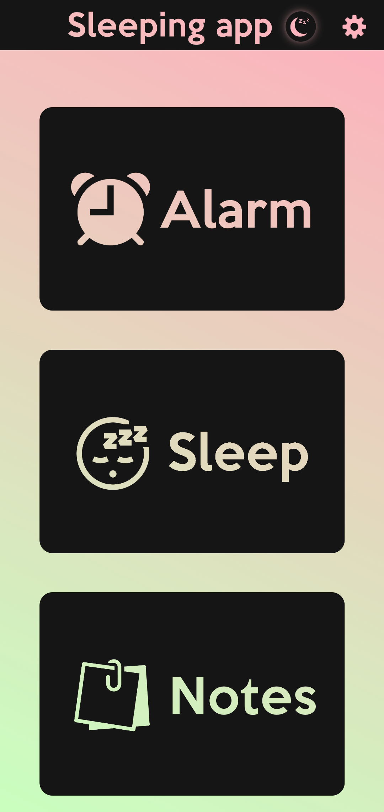
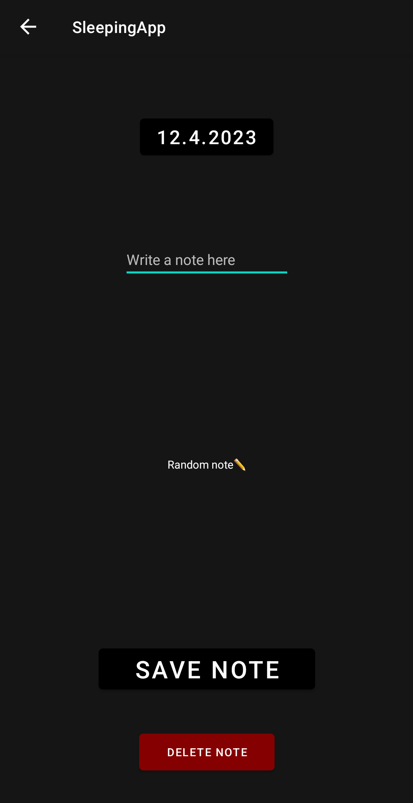
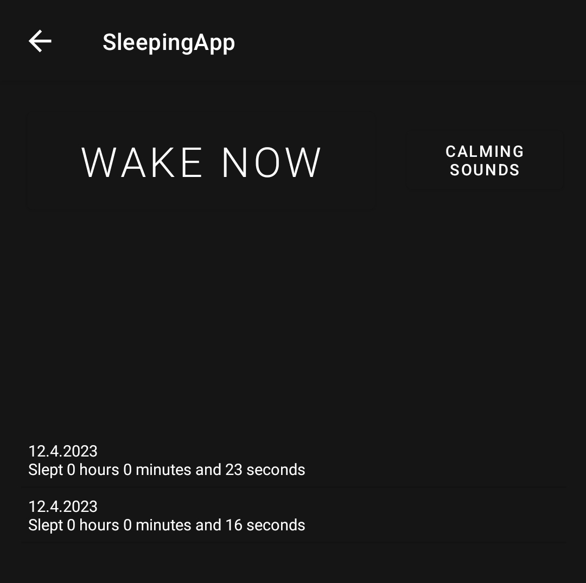
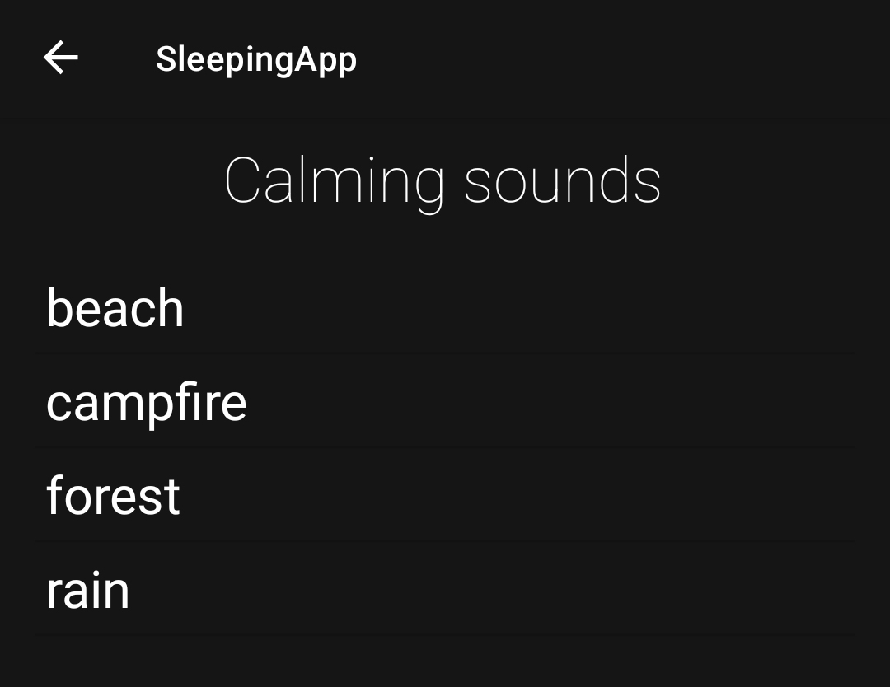
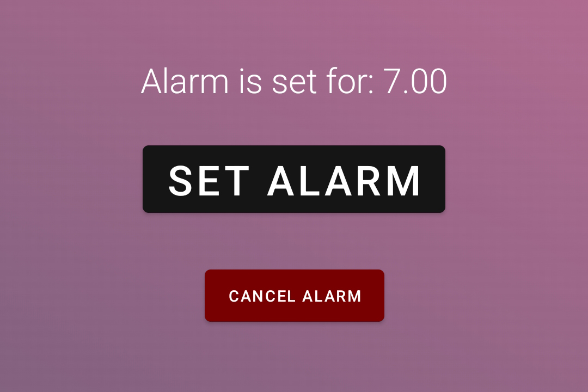

# SleepingApp

This project was done in Metropolia's Mobile health applications course. 
The requirement was to make a simple health app for Android, and as a result, we made an app for keeping up with sleeping habits and improving them for the user

## Features

- Alarm
- Sleeping history
- Calming sounds
- Dream journal (Notes)

## Installation

1. Download the SleepingApp.rar from https://github.com/Samucl/SleepingApp/releases
2. Extract `SleepingApp.rar`
3. Install the APK file on your Android device

## Screenshots

<table>
  <tr>
    <td align="center">
      
    </td>
    <td align="center">
      
    </td>
  </tr>
  <tr>
    <td align="center">
      
    </td>
    <td>
      
    </td>
  </tr>
  <tr>
    <td colspan="2" align="center">
      
    </td>
</table>